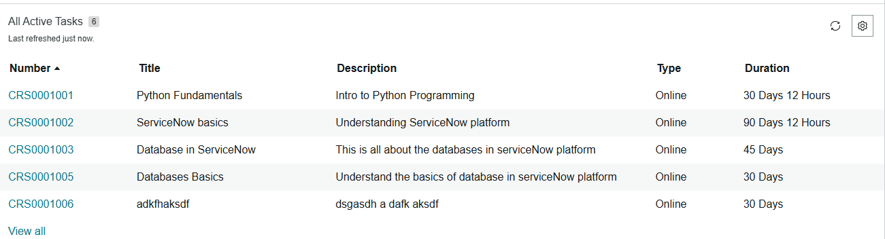

# Course Subscription Application

## Overview
This is a ServiceNow-based course subscription application where learners can view available courses and subscribe to them. Built using ServiceNow platform with UI Builder for the frontend interface.

## Features Implemented

### PRD01: Course List - ✅ COMPLETED
- Displays list of 6 available courses from ServiceNow backend
- Shows course details: Title, Description, Duration  
- Responsive layout using UI Builder repeater component
- Connected to ServiceNow course table

  
   
  <em>Course listing page displaying all available courses</em>

 

  
   
  <em>Individual course cards showing title, description, and duration</em>

### PRD02: Course Subscription - ⚠️ PARTIALLY COMPLETED
- Subscribe buttons integrated into each course card
- Functional event handling for button clicks
- Modal confirmation dialog implemented
- User can interact with subscription flow

<table>
<tr>
<td width="50%">

  
   
  <em>Subscribe button event handlers in UI Builder</em>

</td>
<td width="50%">

  
   
  <em>Confirmation modal dialog</em>

</td>
</tr>
</table>

## Technical Implementation

<strong>🗄️ Backend Setup</strong> (Click to expand)

- ServiceNow development instance configured
- Course table created with sample data (6 courses)
- Subscription table structure created

  
   
  <em>ServiceNow course table with populated sample data</em>

 

  
   
  <em>Data resources and subscription table configuration</em>

<strong>🎨 Frontend Setup</strong> (Click to expand)

- UI Builder used for interface design
- Repeater component for course display
- Event handlers configured for user interactions

<table>
<tr>
<td width="60%">

  
   
  <em>Event handler configuration in UI Builder</em>

</td>
<td width="40%">

  
   
  <em>Console debug output</em>

</td>
</tr>
</table>

## Known Issues

### ⚠️ Subscription Recording Problem
The main technical challenge: while the UI interaction works correctly, subscription records are not being created in the ServiceNow subscription table when users confirm their subscription.

<table>
<tr>
<td width="50%" style="background-color: #d4edda; padding: 10px; border-radius: 5px;">
<h4>✅ What Works:</h4>
<ul>
<li>Subscribe button clicks trigger events</li>
<li>Modal confirmation dialog appears</li>
<li>User can click Yes/Cancel</li>
<li>UI components respond correctly</li>
</ul>
</td>
<td width="50%" style="background-color: #f8d7da; padding: 10px; border-radius: 5px;">
<h4>❌ What Doesn't Work:</h4>
<ul>
<li>No records created in subscription table after confirmation</li>
<li>Backend data insertion fails silently</li>
<li>No error messages displayed to user</li>
</ul>
</td>
</tr>
</table>

## Incomplete Features

Due to the subscription recording issue:
- Creating subscription records (core PRD02 requirement)
- Unsubscribe functionality
- Duplicate subscription prevention
- Visual feedback for successful subscriptions
- Robot Framework test suite

## User Interaction Flow

```mermaid
graph TD
    A[User views course listing page] --> B[User sees available courses with details]
    B --> C[User clicks 'Subscribe' on desired course]
    C --> D[Confirmation modal appears: 'Confirm Subscription?']
    D --> E{User clicks 'Yes' to confirm}
    E -->|Expected| F[✅ Subscription record created]
    E -->|Current Issue| G[❌ No subscription record is created]
    F --> H[Success message displayed]
    G --> I[Silent failure - no feedback]
    
    style F fill:#d4edda
    style G fill:#f8d7da
    style H fill:#d4edda
    style I fill:#f8d7da
```

## Technical Architecture

| Component | Technology | Status |
|-----------|------------|--------|
| **Platform** | ServiceNow | ✅ Configured |
| **Frontend** | UI Builder with repeater components | ✅ Working |
| **Backend** | ServiceNow tables (Course, Subscription) | ⚠️ Partial |
| **Data** | 6 sample courses with titles, descriptions, durations | ✅ Populated |

## Installation and Setup

1. Clone this repository
2. Import ServiceNow application files from `x_quo_coursehub/` folder
3. Configure ServiceNow development instance
4. Access the application through ServiceNow interface

## Testing

Robot Framework test suite was planned but not implemented due to incomplete subscription functionality.

## Future Improvements

| Priority | Feature | Description |
|----------|---------|-------------|
| 🔴 **HIGH** | Fix subscription record creation | Resolve backend data insertion issue |
| 🟡 **MEDIUM** | Implement unsubscribe functionality | Allow users to cancel subscriptions |
| 🟡 **MEDIUM** | Add duplicate subscription prevention | Prevent multiple subscriptions to same course |
| 🟢 **LOW** | Create comprehensive test suite | Robot Framework automation tests |
| 🟢 **LOW** | Add error handling and user feedback | Improve user experience with notifications |

---

### 📋 Project Information

**Author:** Mohan Giri  
**Assignment:** Junior Software Developer - Qualdatrix  
**Platform:** ServiceNow  
**Status:** In Development  

[📎 Original Repository](https://bitbucket.org/qualdatrix/coursehub/src/main/)

